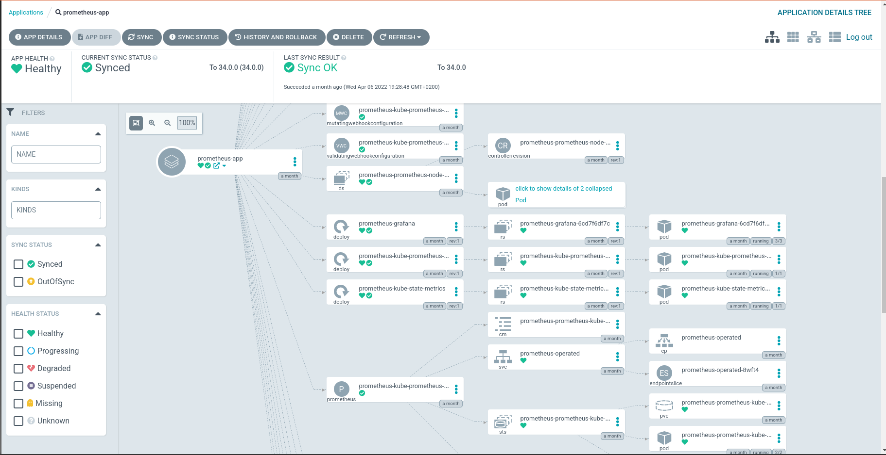
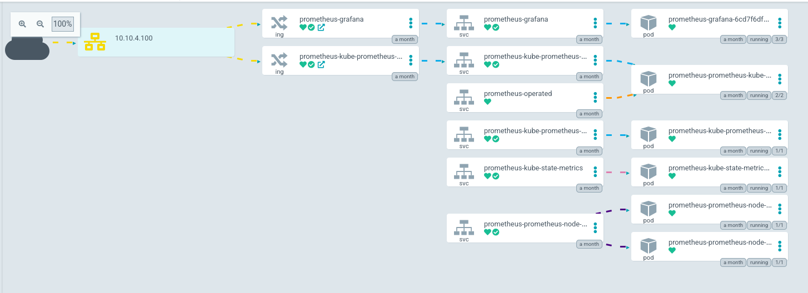

# 5. Argo Apps Deployment

Time to play with Argo CD!

Let's deploy the [Kube-Prometheus-Stack](https://github.com/prometheus-community/helm-charts/blob/main/charts/kube-prometheus-stack/values.yaml) since we will need it to monitor the nodes.

A complete example is written in `argo/monitoring/`, but we will start from scratch to learn the process of writing an Argo CD application.

Start by creating the `argo/my-monitoring` directory, this will be our working directory.

Some objects shouldn't be handled by Argo CD, such as volumes, secrets and namespaces. These objects must be created before the deployment of an Argo application.

## 1. Namespace and AppProject

Start with a namespace:

```yaml title="argo/my-monitoring/namespace.yml"
apiVersion: v1
kind: Namespace
metadata:
  name: my-monitoring
  labels:
    app.kubernetes.io/name: my-monitoring
```

and apply:

```shell title="user@local:/ClusterFactory-CE"
kubectl apply -f argo/my-monitoring/namespace.yml
```

And create an `AppProject`:

```yaml title="argo/my-monitoring/app-project.yml"
apiVersion: argoproj.io/v1alpha1
kind: AppProject
metadata:
  name: my-monitoring
  namespace: argocd
  # Finalizer that ensures that project is not deleted until it is not referenced by any application
  finalizers:
    - resources-finalizer.argocd.argoproj.io
spec:
  description: My monitoring stack
  # Allow manifests to deploy from any Git repos
  sourceRepos:
    - '*'
  # Only permit applications to deploy to the namespace in the same cluster
  destinations:
    - namespace: my-monitoring
      server: https://kubernetes.default.svc

  namespaceResourceWhitelist:
    - kind: '*'
      group: '*'

  clusterResourceWhitelist:
    - kind: '*'
      group: '*'
```

and apply:

```shell title="user@local:/ClusterFactory-CE"
kubectl apply -f argo/my-monitoring/app-project.yml
```

`AppProject` configures the permissions of the `Application`. This is to avoid supply chain attacks (for example malicious resources get injected into the git repositories). You can learn more [here](https://argo-cd.readthedocs.io/en/stable/user-guide/projects/).

## 2. Prepare Volumes, Secrets, ConfigMaps and Ingresses

It is best to know the configuration you need before deploying.

You can read the `values.yaml` file inside the [git repository of kube-prometheus-stack](https://github.com/prometheus-community/helm-charts/blob/main/charts/kube-prometheus-stack/values.yaml).

We won't be deploying AlertManager, but we will deploy Grafana, Prometheus and the Prometheus Operator.

Therefore, we need:

- A persistent volume for Grafana
- A persistent volume for Prometheus
- A secret with the initial admin password for Grafana
- An Ingress for Grafana
- An Ingress for Prometheus

However, we are lucky that the Helm Chart of Kube-Prometheus-Stack already handles ingresses. So we only need to add two PVs and a secret.

If you are not familiar with Helm, it's a software used for templating, similar to Ansible. Every variable is stored inside a `values.yaml` file. Helm can override these values by adding a additional values file on top (for example `values-production.yaml`).

If we were to deploy manually, we would call:

```shell title="user@local:/<helm chart directory>"
helm install \
  -n <namespace> \
  -f values.yaml \
  -f values-production.yaml \
  <app name> \
  ./<path to app>
```

Helm is also a package manager. Like any package manager, you need a repository URL. If we were to install an app coming from a repository, we would call:

```shell title="user@local:/<directory containing values-production.yaml>"
helm repo add <reponame> <repo_url>
helm repo update

helm install \
  -n <namespace> \
  -f values-production.yaml \
  <app name> \
  <reponame>/<app>
```

We would store these commands in scripts. However, Argo CD is capable of deploying Helm applications, but also Kustomize and vanilla Kubernetes definition files. Argo CD is also able to synchronize with the remote repository, which means that it can perform rolling updates.

This way, we can centralize every definition, configuration and environments files inside a Git repository, with a common syntax, in YAML.

More details on Argo CD [here](https://argo-cd.readthedocs.io/en/stable/).

### 2.1. Volumes

We are going the create 2 storage classes with the NFS CSI driver.
The deployment of k0s should have the [NFS CSI driver](https://github.com/kubernetes-csi/csi-driver-nfs) pre-deployed.

You could use other types of storage like [Rook](https://rook.io) or [Longhorn](https://longhorn.io).

```yaml title="argo/my-monitoring/storageclasses.yaml"
apiVersion: storage.k8s.io/v1
kind: StorageClass
metadata:
  name: grafana-nfs
  namespace: my-monitoring
  labels:
    app: grafana-nfs
    topology.kubernetes.io/region: ch-sion
    topology.kubernetes.io/zone: ch-sion-1
provisioner: nfs.csi.k8s.io
parameters:
  server: nfs.example.com
  share: /srv/nfs/k8s/grafana
  mountPermissions: '0775'
mountOptions:
  - hard
  - nfsvers=4.1
  - noatime
  - nodiratime
volumeBindingMode: Immediate
reclaimPolicy: Retain
allowedTopologies:
  - matchLabelExpressions:
      - key: topology.kubernetes.io/zone
        values:
          - ch-sion
---
apiVersion: storage.k8s.io/v1
kind: StorageClass
metadata:
  name: prometheus-nfs
  namespace: my-monitoring
  labels:
    app: prometheus-nfs
    topology.kubernetes.io/region: ch-sion
    topology.kubernetes.io/zone: ch-sion-1
provisioner: nfs.csi.k8s.io
parameters:
  server: nfs.example.com
  share: /srv/nfs/k8s/prometheus
  mountPermissions: '0775'
mountOptions:
  - hard
  - nfsvers=4.1
  - noatime
  - nodiratime
volumeBindingMode: Immediate
reclaimPolicy: Retain
allowedTopologies:
  - matchLabelExpressions:
      - key: topology.kubernetes.io/zone
        values:
          - ch-sion
```

Apply it:

```shell title="user@local:/ClusterFactory-CE"
kubectl apply -f argo/my-monitoring/storageclasses.yaml
```

You could also create one unique StorageClass mounted on `/srv/nfs/k8s` for all the applications. However, this would mix all the volumes into a single directory and for the sake of the NFS server, we won't do that.

You may notice that we've been using `topology.kubernetes.io/zone` since the beginning of the Getting Started.
It's a good practice to always annotate your nodes as some resources are not available in other zones.

You can always learn more [here](https://kubernetes.io/docs/reference/labels-annotations-taints/#topologykubernetesiozone).

You could also create a `PersistentVolume` and a `PersistentVolumeClaim` instead of a `StorageClass` (which is what we've done for [DeepSquare](https://deepsquare.io)). This is called static provisioning and is an acceptable solution.

The official example of static provisioning is written [here](https://github.com/kubernetes-csi/csi-driver-nfs/tree/master/deploy/example). Both methods are good, but dynamic provisioning is more suitable for `StatefulSet` since it avoids creating a `PersistentVolume` for each replica.

### 2.2. Secret

Since we are doing GitOps, we will store a sealed secret in the git repository. Since the secret definition files are in plain text, to keep track of the version of the secrets, we need to push these files into git.

To avoid storing clear-text secrets in git, SealedSecrets encrypts secrets using asymmetric encryption. Currently, a SealedSecrets controller should run on the Kubernetes cluster with a unique private key. This private key is the master key and should only be stored on the Kubernetes cluster.

If you want to backup the key (because you want to do a migration, or to prepare for a disaster), you can follow [this guide](https://github.com/bitnami-labs/sealed-secrets#how-can-i-do-a-backup-of-my-sealedsecrets). You can also [backup the whole cluster using cfctl](/docs/guides/maintenance/backup-restore).

:::warning

The SealedSecrets keys and backups made by k0s are sensitive data! You should either delete them after a certain time or make sure that they are strongly protected.

:::

Create a secret named `grafana-admin-secret.yaml.local`. It is important to add `.local` at the end so it get filtered by Git.

```yaml title="argo/my-monitoring/grafana-admin-secret.yaml.local"
apiVersion: v1
kind: Secret
metadata:
  name: grafana-admin-secret
  namespace: monitoring
stringData:
  admin-password: <FILL ME>
  admin-user: <FILL ME>
type: Opaque
```

**DON'T APPLY IT**. First, we will encrypt it.

Just run the `cfctl kubeseal`, this will generate a `grafana-admin-sealed-secret.yaml`. This file can be put inside the git repository.

Apply this file:

```shell title="user@local:/ClusterFactory-CE"
kubectl apply -f argo/my-monitoring/grafana-admin-sealed-secret.yaml
```

After applying the file, feel free to delete the `-secret.yaml.local` file. If you wish to retrieve the secret, like any secret, just use `kubectl get secret <secret> -o jsonpath='{.data}'`.

## 3. Configure the Argo Application

Let's start with the CRDs of kube-prometheus-stack. Because the CRDs are too large, we need to deploy an Argo CD application which only deploys the CRDs.

Create the file `argo/my-monitoring/prometheus-crd-app.yml` and add:

```yaml title="argo/my-monitoring/prometheus-crd-app.yml"
apiVersion: argoproj.io/v1alpha1
kind: Application
metadata:
  name: prometheus-crd-app
  namespace: argocd
  finalizers:
    - resources-finalizer.argocd.argoproj.io
spec:
  project: monitoring
  source:
    chart: kube-prometheus-stack
    repoURL: https://github.com/prometheus-community/helm-charts.git
    path: charts/kube-prometheus-stack/crds/
    targetRevision: kube-prometheus-stack-39.9.0

    directory:
      recurse: true

  destination:
    server: 'https://kubernetes.default.svc'
    namespace: monitoring

  syncPolicy:
    automated:
      prune: true # Specifies if resources should be pruned during auto-syncing ( false by default ).
      selfHeal: true # Specifies if partial app sync should be executed when resources are changed only in target Kubernetes cluster and no git change detected ( false by default ).
      allowEmpty: false # Allows deleting all application resources during automatic syncing ( false by default ).
    syncOptions:
      - Replace=true
    retry:
      limit: 5 # number of failed sync attempt retries; unlimited number of attempts if less than 0
      backoff:
        duration: 5s # the amount to back off. Default unit is seconds, but could also be a duration (e.g. "2m", "1h")
        factor: 2 # a factor to multiply the base duration after each failed retry
        maxDuration: 3m # the maximum amount of time allowed for the backoff strategy
```

Next, we need to configure the Argo CD application that actually deploys the kube-prometheus stack.

However, in order to apply custom values and still be GitOps compliant, we will need to use the [subchart](https://helm.sh/docs/chart_template_guide/subcharts_and_globals/) pattern.

To do that, in your fork, create a subchart or reuse the existing one:

```yaml title="helm-subcharts/kube-prometheus-stack/Chart.yaml"
apiVersion: v2
name: kube-prometheus-stack-subchart
description: Kube Prometheus Stack subchart
type: application
version: 39.9.0
appVersion: '0.1.2'

dependencies:
  - name: kube-prometheus-stack
    version: 39.9.0
    repository: https://prometheus-community.github.io/helm-charts
```

We will create the `values.yaml` file later on. Create the Argo CD Application which will use the subchart:

```yaml title="argo/my-monitoring/prometheus-app.yml"
apiVersion: argoproj.io/v1alpha1
kind: Application
metadata:
  name: prometheus-app
  namespace: argocd
  finalizers:
    - resources-finalizer.argocd.argoproj.io
spec:
  project: my-monitoring
  source:
    # You should have forked this repo. Change the URL to your fork.
    repoURL: git@github.com:<your account>/ClusterFactory-CE.git
    targetRevision: HEAD
    path: helm-subcharts/kube-prometheus-stack
    helm:
      releaseName: prometheus

      skipCrds: true # skipCrds because CRDs are too long!

      # If the values file is not `values.yaml`:
      # valueFiles:
      #   - values-example.yaml

  destination:
    server: 'https://kubernetes.default.svc'
    namespace: my-monitoring

  syncPolicy:
    automated:
      prune: true # Specifies if resources should be pruned during auto-syncing ( false by default ).
      selfHeal: true # Specifies if partial app sync should be executed when resources are changed only in target Kubernetes cluster and no git change detected ( false by default ).
      allowEmpty: false # Allows deleting all application resources during automatic syncing ( false by default ).
    syncOptions: []
    retry:
      limit: 5 # number of failed sync attempt retries; unlimited number of attempts if less than 0
      backoff:
        duration: 5s # the amount to back off. Default unit is seconds, but could also be a duration (e.g. "2m", "1h")
        factor: 2 # a factor to multiply the base duration after each failed retry
        maxDuration: 3m # the maximum amount of time allowed for the backoff strategy
```

More details [here](https://github.com/argoproj/argo-cd/blob/master/docs/operator-manual/application.yaml).

Since [Kube-Prometheus-Stack](https://github.com/prometheus-community/helm-charts/blob/main/charts/kube-prometheus-stack/values.yaml) is a Helm application, we are going to override some values by creating a `values.yaml` file inside the subchart.

We are also going to configure the Ingresses here.

```yaml title="helm-subcharts/kube-prometheus-stack/values.yaml"
kube-prometheus-stack:
  alertmanager:
    enabled: false

  ## Using default values from https://github.com/grafana/helm-charts/blob/main/charts/grafana/values.yaml
  ##
  grafana:
    enabled: true

    image:
      repository: grafana/grafana-oss
      tag: 8.5.1

    persistence:
      type: pvc
      enabled: true
      storageClassName: grafana-nfs

    securityContext:
      runAsUser: 472
      runAsGroup: 472
      fsGroup: 472

    admin:
      existingSecret: 'grafana-admin-secret'
      userKey: admin-user
      passwordKey: admin-password

    initChownData:
      enabled: false

    ingress:
      enabled: true
      ingressClassName: traefik

      annotations:
        cert-manager.io/cluster-issuer: selfsigned-cluster-issuer
        traefik.ingress.kubernetes.io/router.entrypoints: websecure
        traefik.ingress.kubernetes.io/router.tls: 'true'

      hosts:
        - grafana.example.com

      path: /

      tls:
        - secretName: grafana.example.com-secret
          hosts:
            - grafana.example.com

  ## Component scraping the kube controller manager
  ##
  kubeControllerManager:
    enabled: false

  ## Component scraping coreDns. Use either this or kubeDns
  ##
  coreDns:
    enabled: false

  ## Component scraping kubeDns. Use either this or coreDns
  ##
  kubeDns:
    enabled: false

  ## Component scraping etcd
  ##
  kubeEtcd:
    enabled: false

  ## Component scraping kube scheduler
  ##
  kubeScheduler:
    enabled: false

  ## Component scraping kube proxy
  ##
  kubeProxy:
    enabled: false

  ## Component scraping kube state metrics
  ##
  kubeStateMetrics:
    enabled: true

  ## Configuration for kube-state-metrics subchart
  ##
  kube-state-metrics:
    prometheus:
      monitor:
        enabled: true

  ## Deploy node exporter as a daemonset to all nodes
  ##
  nodeExporter:
    enabled: true

  ## Configuration for prometheus-node-exporter subchart
  ##
  prometheus-node-exporter:
    prometheus:
      monitor:
        enabled: true

  ## Manages Prometheus and Alertmanager components
  ##
  prometheusOperator:
    enabled: true

    ## Resource limits & requests
    ##
    resources:
      limits:
        cpu: 200m
        memory: 200Mi
      requests:
        cpu: 100m
        memory: 100Mi

  ## Deploy a Prometheus instance
  ##
  prometheus:
    enabled: true

    ingress:
      enabled: true

      annotations:
        cert-manager.io/cluster-issuer: selfsigned-cluster-issuer
        traefik.ingress.kubernetes.io/router.entrypoints: websecure
        traefik.ingress.kubernetes.io/router.tls: 'true'

      hosts:
        - prometheus.example.com

      paths:
        - /

      tls:
        - secretName: prometheus.example.com-secret
          hosts:
            - prometheus.example.com

    prometheusSpec:
      ruleSelectorNilUsesHelmValues: false
      serviceMonitorSelectorNilUsesHelmValues: false
      podMonitorSelectorNilUsesHelmValues: false
      probeSelectorNilUsesHelmValues: false

      resources:
        limits:
          cpu: 1
          memory: 2Gi
        requests:
          cpu: 200m
          memory: 2Gi

      storageSpec:
        volumeClaimTemplate:
          spec:
            storageClassName: 'prometheus-nfs'
            accessModes: ['ReadWriteOnce']
            resources:
              requests:
                storage: 50Gi
```

Now, you can commit and push:

```shell title="user@local:/ClusterFactory-CE"
git add .
git commit -m "Added kube-prometheus-stack subchart"
git push
```

You can deploy the Argo CD app:

```shell title="user@local:/ClusterFactory-CE"
kubectl apply -f argo/my-monitoring/prometheus-crd-app.yml
kubectl apply -f argo/my-monitoring/prometheus-app.yml
```

Congratulation, you have deployed an Argo CD app!

You can observe the deployment in the Argo CD dashboard by following the URL [argocd.example.com](https://argocd.example.com).

:::note

To fetch the Argo CD password:

```shell
kubectl get secret -n argocd argocd-initial-admin-secret -o jsonpath="{.data.password}" | base64 --decode)
```

:::





Pretty cool, huh?

However, ClusterFactory isn't just a Kubernetes Cluster. It contains all the apps necessary to create an HPC cluster.

See the [guides](/docs/guides/monitoring/deploy) to deploy each application. Otherwise, let's deploy xCAT, our solution to deploy and manage bare metal servers!
