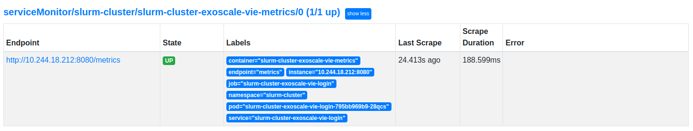

# Setting up dashboards

To set up a dashboard, you need to set up an Ingress Controller (like Traefik). After that, you can create either an `IngressRoute` or an `Ingress`. You also need to configure your DNS.

We will assume that you have followed the [Getting Started](/getting-started/requirements-recommendations) and deployed Traefik as the main Ingress Controller.

## Traefik Dashboard

Assuming you have configured the DNS to redirect `traefik.internal` to `192.168.1.100` which is the entry point for the Load Balancer, the Traefik dashboard should be accessible by default based on the values:

```yaml title="core/traefik/values.yaml > ingressRoute"
ingressRoute:
  dashboard:
    enabled: true
    # See your DNS configuration
    matchRule: Host(`traefik.internal`)
    entryPoints: ['traefik']

ports:
  traefik:
    port: 9000
    expose: true
    exposedPort: 9000
    protocol: TCP
```

You can connect to http://traefik.internal:9000/dashboard/ (the trailing slash is important) to access the dashboard.

## ArgoCD Dashboard

Assuming you have configured the DNS to redirect `argocd.internal` to `192.168.1.100` which is the entry point for the Load Balancer, the ArgoCD dashboard should be accessible by default based on the `IngressRoute`:

```yaml title="core/argo-cd/ingress-route.yaml"
apiVersion: traefik.containo.us/v1alpha1
kind: IngressRoute
metadata:
  name: argocd-server-https
  namespace: argocd
  labels:
    app.kubernetes.io/name: argocd-server-https
    app.kubernetes.io/component: ingress-route
spec:
  entryPoints:
    - websecure
  routes:
    - kind: Rule
      match: Host(`argocd.internal`)
      priority: 10
      services:
        - name: argocd-server
          port: 80
    - kind: Rule
      match: Host(`argocd.internal`) && HeadersRegexp(`Content-Type`, `^application/grpc.*$`)
      priority: 11
      services:
        - name: argocd-server
          port: 80
          scheme: h2c
  tls:
    secretName: argocd.internal-secret
```

And the certificate:

```yaml title="core/argo-cd/certificate.yaml"
apiVersion: cert-manager.io/v1
kind: Certificate
metadata:
  name: argocd.internal-cert
  namespace: argocd
spec:
  secretName: argocd.internal-secret
  issuerRef:
    name: selfsigned-cluster-issuer
    kind: ClusterIssuer
  commonName: argocd.internal
  duration: 43800h
  subject:
    countries: [CH]
    localities: [Lonay]
    organizationalUnits: []
    organizations: [Example Org]
    postalCodes: ['1027']
    provinces: [Laud]
    streetAddresses: [Chemin des Mouettes 1]
  dnsNames:
    - argocd.internal
  emailAddresses:
    - john.smith@example.com
  privateKey:
    size: 4096
    algorithm: RSA
```

You can connect to [https://argocd.internal/](https://argocd.internal/) to access the dashboard. It is also the address for the gRPC API.

## Prometheus and Grafana dashboards

### Configure access to dashboard

Assuming you have configured the DNS to redirect `prometheus.example.com` and `grafana.example.com` to `192.168.1.100` which is the entry point for the Load Balancer, the Prometheus and Grafana dashboards should be accessible by default based on the values:

```yaml title="helm-subcharts/kube-prometheus-stack/values-example.yaml"
kube-prometheus-stack:
  grafana:
    enabled: true

    ingress:
      enabled: true
      ingressClassName: traefik

      annotations:
        cert-manager.io/cluster-issuer: selfsigned-cluster-issuer
        traefik.ingress.kubernetes.io/router.entrypoints: websecure
        traefik.ingress.kubernetes.io/router.tls: 'true'

      hosts:
        - grafana.example.com

      path: /

      tls:
        - secretName: grafana.example.com-secret
          hosts:
            - grafana.example.com

  prometheus:
    enabled: true

    ingress:
      enabled: true

      annotations:
        cert-manager.io/cluster-issuer: selfsigned-cluster-issuer
        traefik.ingress.kubernetes.io/router.entrypoints: websecure
        traefik.ingress.kubernetes.io/router.tls: 'true'

      hosts:
        - prometheus.example.com

      paths:
        - /

      tls:
        - secretName: prometheus.example.com-secret
          hosts:
            - prometheus.example.com
```

You can connect to [https://prometheus.example.com/](https://prometheus.example.com/) or [https://grafana.example.com/](https://grafana.example.com/).

### Adding new Grafana dashboards

#### Adding the SLURM dashboard

You can monitor form the login node.

Simply enable the `ServiceMonitor` in the values:

```yaml title="helm/slurm-cluster/values-production.yaml"
login:
  metrics:
    enabled: true
    gpuAccounting: true

    ## You can customize the command to refresh the tls configs with:
    ## command: ['sh', '-c', 'update-ca-trust && /init']
    command: ['/init']

    # Extra volume mounts (use login.volumes to add volumes)
    volumeMounts: []

    monitor:
      enabled: true
```

**Commit and push the changes.**

You should be able to see the login nodes as targets on the Prometheus Dashboard:



The dashboard ID is 4323, and can be reviewed here: [grafana.com/grafana/dashboards/4323-slurm-dashboard](https://grafana.com/grafana/dashboards/4323-slurm-dashboard/).


You can import the dashboard following this [guide](https://grafana.com/docs/grafana/latest/dashboards/manage-dashboards/).

#### Adding the GPU dashboard

You can use [utkuozdemir/nvidia_gpu_exporter](https://github.com/utkuozdemir/nvidia_gpu_exporter).

You have to install the exporter on the compute nodes.

This is a working postscript that you can use:

```shell title="install-gpu-exporter.sh"
#!/bin/sh

useradd -m -s /bin/bash prometheus || true
mkdir -p /opt/prometheus/

curl -fsSL https://github.com/utkuozdemir/nvidia_gpu_exporter/releases/download/v1.1.0/nvidia_gpu_exporter_1.1.0_linux_x86_64.tar.gz | tar -xzvf - -C /opt/prometheus nvidia_gpu_exporter

## Prometheus nvidia-gpu-exporter
cat <<'EOF' > /etc/systemd/system/nvidia_gpu_exporter.service
[Unit]
Description=Nvidia GPU Exporter
Wants=network-online.target
After=network-online.target
[Service]
Type=simple
User=prometheus
ExecStart=/opt/prometheus/nvidia_gpu_exporter
[Install]
WantedBy=multi-user.target
EOF

#systemctl daemon-reload
systemctl start --no-block nvidia_gpu_exporter
```

After installing and starting the exporter, add a scrape config to the prometheus values:

```yaml title="helm-subcharts/kube-prometheus-stack/values-example.yaml"
kube-prometheus-stack:
  prometheus:
    prometheusSpec:
      additionalScrapeConfigs:
        - job_name: 'nvidia-gpu'
          static_configs:
            - targets:
                - '10.10.2.51:9835'
                - '10.10.2.52:9835'
                - '10.10.2.53:9835'
                - '10.10.2.54:9835'
```

Commit and push the changes. You should be able to see the targets on the Prometheus Dashboard.

You can then import [the dashboard](https://grafana.com/grafana/dashboards/14574-nvidia-gpu-metrics/).

#### Adding the node exporter dashboard

Grafana should already have dashboard configured for the nodes. You can also use the [Node Exporter Full](https://grafana.com/grafana/dashboards/1860-node-exporter-full/).

You have to install the node exporter on the compute nodes. The nodes on the Kubernetes Cluster have already a node exporter.

This is a postscript that you can use:

```shell title="install-gpu-exporter.sh"
#!/bin/sh

useradd -m -s /bin/bash prometheus || true
mkdir -p /opt/prometheus/

curl -fsSL https://github.com/prometheus/node_exporter/releases/download/v1.5.0/node_exporter-1.5.0.linux-amd64.tar.gz | tar -xzvf - --strip-components=1 -C /opt/prometheus node_exporter-1.5.0.linux-amd64/node_exporter

## Prometheus nvidia-gpu-exporter
cat <<'EOF' > /etc/systemd/system/node_exporter.service
[Unit]
Description=Node Exporter
Wants=network-online.target
After=network-online.target
[Service]
Type=simple
User=prometheus
ExecStart=/opt/prometheus/node_exporter
[Install]
WantedBy=multi-user.target
EOF

#systemctl daemon-reload
systemctl start --no-block node_exporter
```

After installing and starting the exporter, add a scrape config to the prometheus values:

```yaml title="helm-subcharts/kube-prometheus-stack/values-example.yaml"
kube-prometheus-stack:
  prometheus:
    prometheusSpec:
      additionalScrapeConfigs:
        - job_name: 'node-exporter'
          static_configs:
            - targets:
                - '10.10.2.51:9100'
                - '10.10.2.52:9100'
                - '10.10.2.53:9100'
                - '10.10.2.54:9100'
```

Commit and push the changes. You should be able to see the targets on the Prometheus Dashboard.
