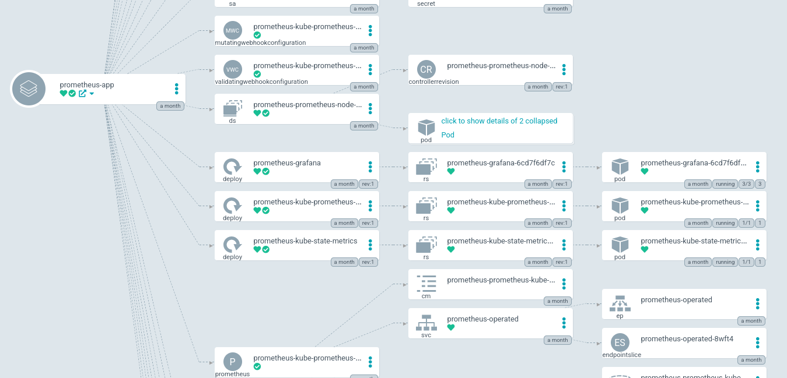

# Deploy the Kube Prometheus Stack



import Tabs from '@theme/Tabs';
import TabItem from '@theme/TabItem';

## Helm and Docker resources

The Helm resources are stored on [the Prometheus Community Git Repository](https://github.com/prometheus-community/helm-charts/tree/main/charts/kube-prometheus-stack).

The docker images used are:

- `quay.io/prometheus/alertmanager`
- `quay.io/prometheus-operator/prometheus-operator`
- `quay.io/prometheus/prometheus`
- `quay.io/prometheus-operator/prometheus-config-reloader`
- (`quay.io/thanos/thanos`)
- `docker.io/grafana/grafana-oss`

Like in the Getting Started, we won't be deploying Thanos and AlertManager.

## 1. Deploy Namespace and AppProject

```shell title="user@local:/ClusterFactory"
kubectl apply -f argo/monitoring/
```

## 2. Persistent Volumes, PVC and Secrets

### 2.a. Creating a `StorageClass` or `PersistentVolume`

We will use NFS. Feel free to use another type of storage. We recommend at least 100 GB since the storage is used to store the root file system of the operating system images.

<Tabs groupId="volume">
  <TabItem value="storage-class" label="StorageClass (dynamic)" default>

```yaml title="argo/monitoring/volumes/storage-classes.yaml"
apiVersion: storage.k8s.io/v1
kind: StorageClass
metadata:
  name: grafana-nfs
  namespace: monitoring
  labels:
    app: grafana
    topology.kubernetes.io/region: <FILL ME> # <country code>-<city>
    topology.kubernetes.io/zone: <FILL ME> # <country code>-<city>-<index>
provisioner: nfs.csi.k8s.io
parameters:
  server: <FILL ME> # IP or host
  share: <FILL ME> # /srv/nfs/k8s/grafana
  mountPermissions: '0775'
mountOptions:
  - hard
  - nfsvers=4.1
  - noatime
  - nodiratime
volumeBindingMode: Immediate
reclaimPolicy: Retain
allowedTopologies:
  - matchLabelExpressions:
      - key: topology.kubernetes.io/region
        values:
          - <FILL ME> # <country code>-<city>
---
apiVersion: storage.k8s.io/v1
kind: StorageClass
metadata:
  name: prometheus-nfs
  namespace: monitoring
  labels:
    app: prometheus
    topology.kubernetes.io/region: <FILL ME> # <country code>-<city>
    topology.kubernetes.io/zone: <FILL ME> # <country code>-<city>-<index>
provisioner: nfs.csi.k8s.io
parameters:
  server: <FILL ME> # IP or host
  share: <FILL ME> # /srv/nfs/k8s/prometheus
  mountPermissions: '0775'
mountOptions:
  - hard
  - nfsvers=4.1
  - noatime
  - nodiratime
volumeBindingMode: Immediate
reclaimPolicy: Retain
allowedTopologies:
  - matchLabelExpressions:
      - key: topology.kubernetes.io/region
        values:
          - <FILL ME> # <country code>-<city>
```

```shell title="user@local:/ClusterFactory"
kubectl apply -f argo/monitoring/volumes/storage-classes.yaml
```

  </TabItem>
  <TabItem value="persistent-volume" label="PersistentVolume (static)">

```yaml title="argo/monitoring/volumes/persistent-volumes.yaml"
apiVersion: v1
kind: PersistentVolume
metadata:
  name: grafana-pv
  namespace: monitoring
  labels:
    app: grafana
    topology.kubernetes.io/region: <FILL ME> # <country code>-<city>
    topology.kubernetes.io/zone: <FILL ME> # <country code>-<city>-<index>
spec:
  capacity:
    storage: 100Gi
  mountOptions:
    - hard
    - nfsvers=4.1
    - noatime
    - nodiratime
  csi:
    driver: nfs.csi.k8s.io
    readOnly: false
    volumeHandle: <unique id> # uuidgen
    volumeAttributes:
      server: <FILL ME> # IP or host
      share: <FILL ME> # /srv/nfs/k8s/grafana
  accessModes:
    - ReadWriteOnce
  persistentVolumeReclaimPolicy: Retain
---
apiVersion: v1
kind: PersistentVolume
metadata:
  name: prometheus-pv
  namespace: monitoring
  labels:
    app: prometheus
    topology.kubernetes.io/region: <FILL ME> # <country code>-<city>
    topology.kubernetes.io/zone: <FILL ME> # <country code>-<city>-<index>
spec:
  capacity:
    storage: 100Gi
  mountOptions:
    - hard
    - nfsvers=4.1
    - noatime
    - nodiratime
  csi:
    driver: nfs.csi.k8s.io
    readOnly: false
    volumeHandle: <unique id> # uuidgen
    volumeAttributes:
      server: <FILL ME> # IP or host
      share: <FILL ME> # /srv/nfs/k8s/prometheus
  accessModes:
    - ReadWriteOnce
  persistentVolumeReclaimPolicy: Retain
```

```shell title="user@local:/ClusterFactory"
kubectl apply -f argo/monitoring/volumes/persistent-volumes.yaml
```

The label `app=prometheus` will be used by the PersistentVolumeClaim.

We also need a PVC for Grafana:

```yaml title="argo/monitoring/volumes/persistent-volume-claim.yaml"
apiVersion: v1
kind: PersistentVolumeClaim
metadata:
  name: grafana-pv-claim
  namespace: monitoring
spec:
  volumeName: grafana-pv
  storageClassName: ''
  accessModes:
    - ReadWriteMany
  resources:
    requests:
      storage: 10Gi
```

```shell title="user@local:/ClusterFactory"
kubectl apply -f argo/monitoring/volumes/persistent-volume-claim.yaml
```

  </TabItem>
</Tabs>

### 2.b. Add initial Grafana password as Secret

Create a SealedSecret which contains the initial credentials for Grafana:

1. Create a `-secret.yaml.local` file:

```yaml title="argo/monitoring/secrets/grafana-admin-secret.yaml.local"
apiVersion: v1
kind: Secret
metadata:
  name: grafana-admin-secret
  namespace: monitoring
stringData:
  admin-password: password
  admin-user: admin
```

2. Seal the secret:

```shell title="user@local:/ClusterFactory"
cfctl kubeseal
```

3. Apply the SealedSecret:

```shell title="user@local:/ClusterFactory"
kubectl apply -f argo/monitoring/secrets/grafana-admin-sealed-secret.yaml
```

## 3. Editing `prometheus-app.yaml` to use the fork

Replace the `repoURL` with the url of your fork:

```yaml title="argo/monitoring/apps/prometheus-app.yaml > spec > source"
source:
  # You should have forked this repo. Change the URL to your fork.
  repoURL: git@github.com:<your account>/ClusterFactory.git
  # You should your branch too.
  targetRevision: HEAD
  path: helm-subcharts/kube-prometheus-stack
  helm:
    releaseName: prometheus

    skipCrds: true

    # If the values file is not `values.yaml`:
    # valueFiles:
    #   - values-example.yaml
```

## 4. Add the values file to the subchart

:::tip

Read the [`values.yaml`](https://github.com/prometheus-community/helm-charts/blob/main/charts/kube-prometheus-stack/values.yaml) to see all the default values.

:::

Create a `values.yaml` inside the `helm-subcharts/kube-prometheus-stack` directory.

<Tabs groupId="volume">
  <TabItem value="storage-class" label="StorageClass (dynamic)" default>

```yaml title="helm-subcharts/kube-prometheus-stack/values.yaml"
kube-prometheus-stack:
  alertmanager:
    enabled: false

  grafana:
    enabled: true

    image:
      repository: grafana/grafana-oss
      tag: 8.4.5

    persistence:
      type: pvc
      enabled: true
      storageClassName: grafana-nfs

    securityContext:
      runAsUser: 472
      runAsGroup: 472
      fsGroup: 472

    admin:
      existingSecret: 'grafana-admin-secret'
      userKey: admin-user
      passwordKey: admin-password

    initChownData:
      enabled: false

    ingress:
      enabled: true
      ingressClassName: traefik

      annotations:
        cert-manager.io/cluster-issuer: selfsigned-cluster-issuer
        traefik.ingress.kubernetes.io/router.entrypoints: websecure
        traefik.ingress.kubernetes.io/router.tls: 'true'

      hosts:
        - grafana.example.com

      path: /

      tls:
        - secretName: grafana.example.com-secret
          hosts:
            - grafana.example.com

  ## Component scraping the kube controller manager
  ##
  kubeControllerManager:
    enabled: false

  ## Component scraping coreDns. Use either this or kubeDns
  ##
  coreDns:
    enabled: false

  ## Component scraping kubeDns. Use either this or coreDns
  ##
  kubeDns:
    enabled: false

  ## Component scraping etcd
  ##
  kubeEtcd:
    enabled: false

  ## Component scraping kube scheduler
  ##
  kubeScheduler:
    enabled: false

  ## Component scraping kube proxy
  ##
  kubeProxy:
    enabled: false

  ## Component scraping kube state metrics
  ##
  kubeStateMetrics:
    enabled: true

  ## Configuration for kube-state-metrics subchart
  ##
  kube-state-metrics:
    prometheus:
      monitor:
        enabled: true

  ## Deploy node exporter as a daemonset to all nodes
  ##
  nodeExporter:
    enabled: true

  ## Configuration for prometheus-node-exporter subchart
  ##
  prometheus-node-exporter:
    prometheus:
      monitor:
        enabled: true

  ## Manages Prometheus and Alertmanager components
  ##
  prometheusOperator:
    enabled: true

  ## Deploy a Prometheus instance
  ##
  prometheus:
    enabled: true

    ingress:
      enabled: true

      annotations:
        cert-manager.io/cluster-issuer: selfsigned-cluster-issuer
        traefik.ingress.kubernetes.io/router.entrypoints: websecure
        traefik.ingress .kubernetes.io/router.tls: 'true'

      hosts:
        - prometheus.example.com

      paths:
        - /

      tls:
        - secretName: prometheus.example.com-secret
          hosts:
            - prometheus.example.com

    prometheusSpec:
      ruleSelectorNilUsesHelmValues: false
      serviceMonitorSelectorNilUsesHelmValues: false
      podMonitorSelectorNilUsesHelmValues: false
      probeSelectorNilUsesHelmValues: false

      resources:
        limits:
          cpu: 1
          memory: 2Gi
        requests:
          cpu: 200m
          memory: 2Gi

      storageSpec:
        volumeClaimTemplate:
          spec:
            storageClassName: 'prometheus-nfs'
            accessModes: ['ReadWriteOnce']
            resources:
              requests:
                storage: 50Gi
```

  </TabItem>
  <TabItem value="persistent-volume" label="PersistentVolume (static)">

```yaml title="helm-subcharts/kube-prometheus-stack/values.yaml"
kube-prometheus-stack:
  alertmanager:
    enabled: false

  grafana:
    enabled: true

    image:
      repository: grafana/grafana-oss
      tag: 8.4.5

    persistence:
      type: pvc
      enabled: true
      existingClaim: grafana-pv-claim

    securityContext:
      runAsUser: 472
      runAsGroup: 472
      fsGroup: 472

    admin:
      existingSecret: 'grafana-admin-secret'
      userKey: admin-user
      passwordKey: admin-password

    initChownData:
      enabled: false

    ingress:
      enabled: true
      ingressClassName: traefik

      annotations:
        cert-manager.io/cluster-issuer: selfsigned-cluster-issuer
        traefik.ingress.kubernetes.io/router.entrypoints: websecure
        traefik.ingress.kubernetes.io/router.tls: 'true'

      hosts:
        - grafana.example.com

      path: /

      tls:
        - secretName: grafana.example.com-secret
          hosts:
            - grafana.example.com

  ## Component scraping the kube controller manager
  ##
  kubeControllerManager:
    enabled: false

  ## Component scraping coreDns. Use either this or kubeDns
  ##
  coreDns:
    enabled: false

  ## Component scraping kubeDns. Use either this or coreDns
  ##
  kubeDns:
    enabled: false

  ## Component scraping etcd
  ##
  kubeEtcd:
    enabled: false

  ## Component scraping kube scheduler
  ##
  kubeScheduler:
    enabled: false

  ## Component scraping kube proxy
  ##
  kubeProxy:
    enabled: false

  ## Component scraping kube state metrics
  ##
  kubeStateMetrics:
    enabled: true

  ## Configuration for kube-state-metrics subchart
  ##
  kube-state-metrics:
    prometheus:
      monitor:
        enabled: true

  ## Deploy node exporter as a daemonset to all nodes
  ##
  nodeExporter:
    enabled: true

  ## Configuration for prometheus-node-exporter subchart
  ##
  prometheus-node-exporter:
    prometheus:
      monitor:
        enabled: true

  ## Manages Prometheus and Alertmanager components
  ##
  prometheusOperator:
    enabled: true

  ## Deploy a Prometheus instance
  ##
  prometheus:
    enabled: true

    ingress:
      enabled: true

      annotations:
        cert-manager.io/cluster-issuer: selfsigned-cluster-issuer
        traefik.ingress.kubernetes.io/router.entrypoints: websecure
        traefik.ingress .kubernetes.io/router.tls: 'true'

      hosts:
        - prometheus.example.com

      paths:
        - /

      tls:
        - secretName: prometheus.example.com-secret
          hosts:
            - prometheus.example.com

    prometheusSpec:
      ruleSelectorNilUsesHelmValues: false
      serviceMonitorSelectorNilUsesHelmValues: false
      podMonitorSelectorNilUsesHelmValues: false
      probeSelectorNilUsesHelmValues: false

      resources:
        limits:
          cpu: 1
          memory: 2Gi
        requests:
          cpu: 200m
          memory: 2Gi

      storageSpec:
        volumeClaimTemplate:
          spec:
            volumeName: 'prometheus-pv'
            storageClassName: ''
            accessModes: ['ReadWriteOnce']
            resources:
              requests:
                storage: 50Gi
```

  </TabItem>
</Tabs>

In case you don't know how to use `Ingress` with `cert-manager` and Traefik. Use the annotations `traefik.ingress.kubernetes.io/router.entrypoints` and `traefik.ingress.kubernetes.io/router.tls` to indicate the port used by Traefik.

The `cfctl.yaml` indicates that the entry-point `websecure` is port 443.

More about Traefik with Kubernetes Ingresses in [their documentation](https://doc.traefik.io/traefik/routing/providers/kubernetes-ingress/).

Use the annotation `cert-manager.io/cluster-issuer` to indicate the certificate issuer and specify the generated certificate secret name in the `tls[].secretName` field. `cert-manager` will automatically search or generate the TLS certificates.

More about `cert-manager` in [their documentation](https://cert-manager.io/docs/usage/ingress/).

:::info

Notice that `initChownData` is not enabled. This is because our NFS server does not allow `chown` (change the owner of a directory) from a client.

This means that, for security reasons, our NFS server manages the permissions itself, i.e. :

```shell root@nfs
chown 472:472 /srv/nfs/k8s/grafana
chown 1000:2000 /srv/nfs/k8s/prometheus
```

:::

## 5. Deploy the app

Commit and push:

```shell title="user@local:/ClusterFactory"
git add .
git commit -m "Added Prometheus stack application and values"
git push
```

And deploy:

```shell title="user@local:/ClusterFactory"
kubectl apply -f argo/monitoring/apps/prometheus-crd-app.yaml
kubectl apply -f argo/monitoring/apps/prometheus-app.yaml
```
