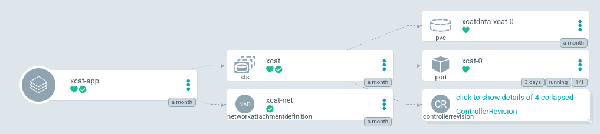
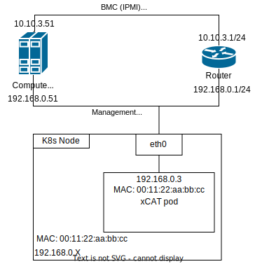

# How to deploy xCAT

import Tabs from '@theme/Tabs';
import TabItem from '@theme/TabItem';



## Helm and Docker resources

The Helm resources are stored on [ClusterFactory Git Repository](https://github.com/SquareFactory/ClusterFactory/tree/main/helm/xcat).

The Dockerfile is described in the git repository [SquareFactory/xcat-rocky](https://github.com/SquareFactory/xcat-rocky).

An Docker image can be pulled with:

```shell
docker pull ghcr.io/squarefactory/xcat-rocky:latest
```

## 1. Deploy Namespace and AppProject

```shell title="user@local:/ClusterFactory"
kubectl apply -f argo/provisioning/
```

## 2. Creating a `StorageClass` or `PersistentVolume`

We will use NFS. Feel free to use another type of storage. We recommend at least 100 GB since the storage is used to store the root file system of the operating system images.

<Tabs groupId="volume">
  <TabItem value="storage-class" label="StorageClass (dynamic)" default>

```yaml title="argo/provisioning/volumes/storage-class.yaml"
apiVersion: storage.k8s.io/v1
kind: StorageClass
metadata:
  name: xcat-nfs
  namespace: provisioning
  labels:
    app: xcat
    topology.kubernetes.io/region: <FILL ME> # <country code>-<city>
    topology.kubernetes.io/zone: <FILL ME> # <country code>-<city>-<index>
provisioner: nfs.csi.k8s.io
parameters:
  server: <FILL ME> # IP or host
  share: <FILL ME> # /srv/nfs/k8s/xcat
  mountPermissions: '0775'
mountOptions:
  - hard
  - nfsvers=4.1
  - noatime
  - nodiratime
volumeBindingMode: Immediate
reclaimPolicy: Retain
allowedTopologies:
  - matchLabelExpressions:
      - key: topology.kubernetes.io/region
        values:
          - <FILL ME> # <country code>-<city>
```

```shell title="user@local:/ClusterFactory"
kubectl apply -f argo/provisioning/volumes/storage-class.yaml
```

  </TabItem>
  <TabItem value="persistent-volume" label="PersistentVolume (static)">

```yaml title="argo/provisioning/volumes/persistent-volume.yaml"
apiVersion: v1
kind: PersistentVolume
metadata:
  name: xcat-pv
  namespace: provisioning
  labels:
    app: xcat
    topology.kubernetes.io/region: <FILL ME> # <country code>-<city>
    topology.kubernetes.io/zone: <FILL ME> # <country code>-<city>-<index>
spec:
  capacity:
    storage: 100Gi
  mountOptions:
    - hard
    - nfsvers=4.1
    - noatime
    - nodiratime
  csi:
    driver: nfs.csi.k8s.io
    readOnly: false
    volumeHandle: <unique id> # uuidgen
    volumeAttributes:
      server: <FILL ME> # IP or host
      share: <FILL ME> # /srv/nfs/k8s/xcat
  accessModes:
    - ReadWriteOnce
  persistentVolumeReclaimPolicy: Retain
```

```shell title="user@local:/ClusterFactory"
kubectl apply -f argo/provisioning/volumes/persistent-volume.yaml
```

The label `app=xcat` will be used by the PersistentVolumeClaim.

  </TabItem>
</Tabs>

## 3. Editing `xcat-app.yaml` to use the fork

```yaml title="argo.example/provisioning/apps/xcat-app.yaml > spec > source"
source:
  # You should have forked this repo. Change the URL to your fork.
  repoURL: git@github.com:<your account>/ClusterFactory.git
  # You should use your branch too.
  targetRevision: HEAD
  path: helm/xcat
  helm:
    releaseName: xcat

    valueFiles:
      - values-production.yaml
```

## 4. Adding custom values

:::tip

Read the [`values.yaml`](https://github.com/SquareFactory/ClusterFactory/blob/main/helm/xcat/values.yaml) to see all the default values.

:::

### 4.a. Add the values file to the chart

Create `values-production.yaml` inside the `helm/xcat/` directory.

### 4.b. Selecting a zone

xCAT will use the host network. Make sure that xCAT stays on the same network by using the `nodeSelector`.

Your nodes should be annotated with `topology.kubernetes.io/region` and `topology.kubernetes.io/zone`.

```yaml title="helm/xcat/values-production.yaml"
nodeSelector:
  topology.kubernetes.io/region: <FILL ME> # <country code>-<city>
  topology.kubernetes.io/zone: <FILL ME> # <country code>-<city>-<index>
```

### 4.c. Network configuration

xCAT will be connected to the host network using the IPVLAN CNI plugin. Make sure that Multus CNI is already installed.

:::tip

Check with:

```shell
> kubectl get daemonset -n kube-system kube-multus-ds
NAME             DESIRED   CURRENT   READY   UP-TO-DATE   AVAILABLE   NODE SELECTOR   AGE
kube-multus-ds   1         1         1       1            1           <none>          28d
```

If it isn't already deployed, you can deploy Multus with:

```shell
kubectl apply -f https://raw.githubusercontent.com/k8snetworkplumbingwg/multus-cni/master/deployments/multus-daemonset-thick-plugin.yaml
```

:::



Similar to configuring the network interface of a Virtual Machine, you must change these fields:

```yaml title="title="helm/xcat/values-production.yaml"
# ...

net:
  # Kubernetes host interface
  masterInterface: eth0
  mode: l2
  type: ipvlan

  # https://www.cni.dev/plugins/current/ipam/static/
  ipam:
    type: static
    addresses:
      - address: 192.168.0.3/24
        gateway: 192.168.0.1
    routes:
      - dst: 0.0.0.0/0
      - dst: 192.168.0.0/24
        gw: 192.168.0.1

  # https://kubernetes.io/docs/concepts/services-networking/dns-pod-service/#pod-dns-config
  dns:
    nameservers:
      - 127.0.0.1
```

Use IPAM `static` since xCAT has a ISC DHCP server.

### 4.d. Volume configuration

<Tabs groupId="volume">
  <TabItem value="storage-class" label="StorageClass (dynamic)" default>

Edit the values accordingly:

```yaml title="helm/xcat/values-production.yaml"
# ...
persistence:
  storageClassName: 'xcat-nfs'
  accessModes: ['ReadWriteOnce']
  size: 50Gi
```

  </TabItem>
  <TabItem value="persistent-volume" label="PersistentVolume (static)">

```yaml title="helm/xcat/values-production.yaml"
# ...
persistence:
  storageClassName: ''
  accessModes: ['ReadWriteOnce']
  size: 50Gi
  selectorLabels:
    app: xcat
    topology.kubernetes.io/region: <FILL ME> # <country code>-<city>
    topology.kubernetes.io/zone: <FILL ME> # <country code>-<city>-<index>
```

  </TabItem>
</Tabs>

## 5. Deploy xCAT

Commit and push:

```shell title="user@local:/ClusterFactory"
git add .
git commit -m "Added xCAT application and values"
git push
```

And deploy:

```shell title="user@local:/ClusterFactory"
kubectl apply -f argo/provisioning/apps/xcat-app.yaml
```
