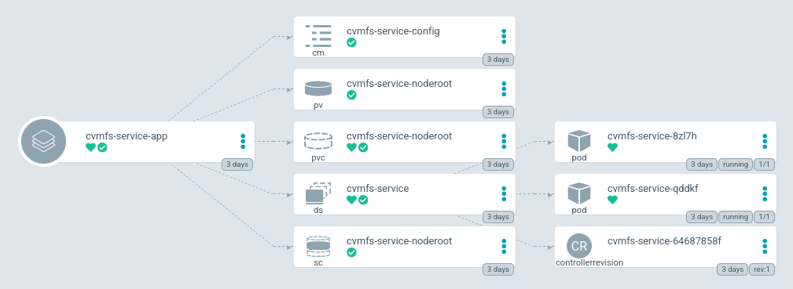

# Mount CVMFS repositories on Kubernetes



:::warning

The CVMFS CSI Plugin isn't stable yet, so we have to do it the old way: using `hostPath`.

:::

## Helm and Docker resources

The Helm resources are stored on [ClusterFactory Git Repository](https://github.com/SquareFactory/ClusterFactory-CE/tree/main/helm/cvmfs-service).

The Dockerfile is described in the git repository [cvmfs/cvmfs](https://github.dev/cvmfs/cvmfs/blob/devel/packaging/container/Dockerfile).

A Docker image can be pulled with:

```sh
docker pull docker.io/cvmfs/cvmfs:latest
```

## 1. AppProject

Apply the AppProject:

```shell title="user@local:/ClusterFactory-CE"
kubectl apply -f argo/cvmfs/app-project.yml
```

## 2. Secrets

Create a SealedSecret which contains the keys of the repositories:

1. Create a `-secret.yml.local` file:

```yaml title="argo/cvmfs/secrets/cvmfs-keys-secret.yml.local"
apiVersion: v1
kind: Secret
metadata:
  name: cvmfs-keys-secret
  namespace: cvmfs
type: Opaque
stringData:
  software.sion.csquare.run.pub: |
    -----BEGIN PUBLIC KEY-----
    ...
    -----END PUBLIC KEY-----
```

2. Seal the secret:

```shell title="user@local:/ClusterFactory-CE"
./kubeseal-every-local-files.sh
```

3. Apply the SealedSecret:

```shell title="user@local:/ClusterFactory-CE"
kubectl apply -f argo/cvmfs/secrets/cvmfs-keys-sealed-secret.yml
```

## 3. Editing `cvmfs-service-app.yml` to use the fork

Change the `repoURL` to the URL used to pull the fork. Also add the `values-production.yaml` file to customize the values.

```yaml title="argo/provisioning/apps/cvmfs-service-app.yml > spec > source"
source:
  # You should have forked this repo. Change the URL to your fork.
  repoURL: git@github.com:<your account>/ClusterFactory-CE.git
  targetRevision: HEAD
  path: helm/cvmfs-service
  helm:
    releaseName: cvmfs-service

    # Create a values file inside your fork and change the values.
    valueFiles:
      - values-production.yaml
```

## 4. Adding custom values to the chart

:::tip

Read the [`values.yaml`](https://github.com/SquareFactory/ClusterFactory-CE/blob/main/helm/cvmfs-service/values.yaml) to see all the default values.

:::

### 4.a. Create the values file

Create the values file `values-production.yaml` inside the `helm/cvmfs-service/` directory.

### 4.b. Select the CVMFS repositories

```yaml title="helm/cvmfs-service/values-production.yaml"
repositories:
  - name: software-sion-csquare-run
    repository: software.sion.csquare.run
```

### 4.c. Configure the CVMFS client

```yaml title="helm/cvmfs-service/values-production.yaml"
# ...
configs:
  default.local:
    mountPath: default.local
    contents: |
      CVMFS_QUOTA_LIMIT=-1
      CVMFS_USE_GEOAPI=no
      CVMFS_HTTP_PROXY="DIRECT"
      CVMFS_KEYS_DIR="/etc/cvmfs/keys"
      CVMFS_SERVER_URL="http://cvmfs.ch1.deepsquare.run/cvmfs/@fqrn@"
      CVMFS_USER=root
```

### 4.d. Configure the keys

```yaml title="helm/cvmfs-service/values-production.yaml"
# ...
keys:
  secretName: 'cvmfs-keys-secret'
```

The keys will be mounted on the `/etc/cvmfs/keys` directory. If you wish to change the path of each key:

```yaml title="helm/cvmfs-service/values-production.yaml"
#...
keys:
  secretName: 'cvmfs-keys-secret'
  items:
    - key: software.sion.csquare.run.pub
      path: sion.csquare.run/software.sion.csquare.run.pub
```

The key will be moved to the path `/etc/cvmfs/keys/sion.csquare.run/software.sion.csquare.run.pub`.

## 5. Deploy the CVMFS service

Commit and push:

```shell title="user@local:/ClusterFactory-CE"
git add .
git commit -m "Added CVMFS service"
git push
```

And deploy the Argo CD application:

```shell title="user@local:/ClusterFactory-CE"
kubectl apply -f argo/provisioning/apps/cvmfs-service-app.yml
```

## 6. Mount the repositories to a container

```yaml title="job.yaml"
apiVersion: batch/v1
kind: Job
metadata:
  name: list-cvmfs
spec:
  template:
    spec:
      containers:
        - name: list-cvmfs
          image: busybox
          command: ['ls', '/cvmfs/software.sion.csquare.run']
          volumeMounts:
            - mountPath: /cvmfs/software.sion.csquare.run
              name: software-sion-csquare-run
              readOnly: true
      restartPolicy: Never
      volumes:
        - name: software-sion-csquare-run
          hostPath:
            path: /cvmfs/cvmfs-k8s/mounts/software.sion.csquare.run
            type: Directory
  backoffLimit: 0
```
