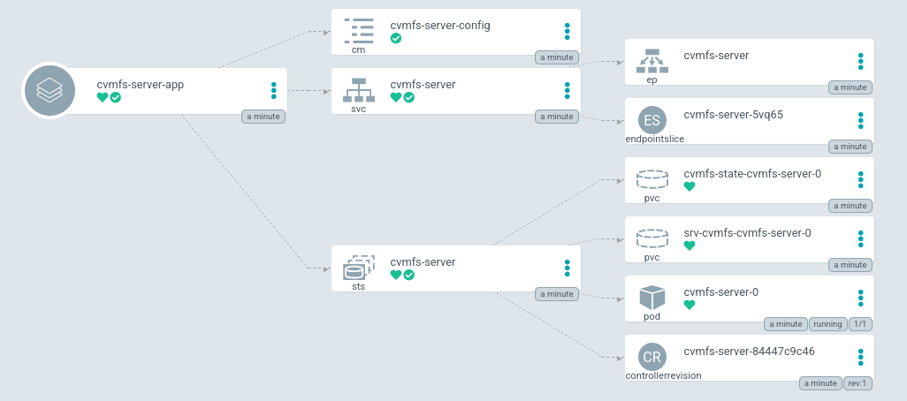

# Deploy a CVMFS Stratum 1



Let's assume we plan to replicate `http://cvmfs.example.com/cvmfs/repo.example.com`.

## Helm and Docker resources

The Helm resources are stored on [ClusterFactory Git Repository](https://github.com/SquareFactory/ClusterFactory/tree/main/helm/cvmfs-server).

The Dockerfile is described in the git repository [SquareFactory/cvmfs-server-docker](https://github.com/SquareFactory/cvmfs-server-docker).

A Docker image can be pulled with:

```sh
docker pull ghcr.io/squarefactory/cvmfs-server:latest
```

## 1. Deploy Namespace and AppProject

```shell title="user@local:/ClusterFactory"
kubectl apply -f argo/cvmfs/
```

## 2. Persistent Volumes, Secrets and PVC

### 2.a. Write the CVMFS public key

Create a SealedSecret which contains the keys of the repositories:

1. Create a `-secret.yaml.local` file:

```yaml title="argo/cvmfs/secrets/keys-secret.yaml.local"
apiVersion: v1
kind: Secret
metadata:
  name: keys-secret
  namespace: cvmfs
type: Opaque
stringData:
  repo.example.com.pub: |
    -----BEGIN PUBLIC KEY-----
    ...
    -----END PUBLIC KEY-----
```

2. Seal the secret:

```shell title="user@local:/ClusterFactory"
cfctl kubeseal
```

3. Apply the SealedSecret:

```shell title="user@local:/ClusterFactory"
kubectl apply -f argo/cvmfs/secrets/keys-sealed-secret.yaml
```

### 2.b Deploy a `PersistentVolume` or `StorageClass`

While we could use _NFS_ to as persistent storage for the replica, let's deploy a [`local-path-provisioner`](https://github.com/rancher/local-path-provisioner).

Basically, `local-path-provisioner` creates the `/opt/local-path-provisioner` directory on the nodes. It allocates dynamically a volume in that directory using a StorageClass.

To deploy the provisioner:

```shell title="user@local:/ClusterFactory"
kubectl apply -f argo/default/apps/local-path-provisioner-app.yaml
```

The `StorageClass` `local-path` should be deployed.

## 3. Editing `cvmfs-server-app.yaml` to use the fork

Change the `repoURL` to the URL used to pull the fork. Also add the `values-production.yaml` file to customize the values.

```yaml title="argo.example/cvmfs/apps/cvmfs-server-app.yaml > spec > source"
source:
  # You should have forked this repo. Change the URL to your fork.
  repoURL: git@github.com:<your account>/ClusterFactory.git
  # You should your branch too.
  targetRevision: HEAD
  path: helm/cvmfs-server
  helm:
    releaseName: cvmfs-server

    # Create a values file inside your fork and change the values.
    valueFiles:
      - values-production.yaml
```

## 4. Adding custom values to the chart

:::tip

Read the [`values.yaml`](https://github.com/SquareFactory/ClusterFactory/blob/main/helm/cvmfs-server/values.yaml) to see all the default values.

:::

### 4.a. Create the values file

Create the values file `values-production.yaml` inside the `helm/cvmfs-server/` directory.

### 4.b. Select the nodes

Because we are using `local-path`, you should select the nodes hosting the volumes.

```yaml title="helm/cvmfs-server/values-production.yaml"
nodeSelector:
  kubernetes.io/hostname: my-node
```

### 4.c. Mount the keys

```yaml title="helm/cvmfs-server/values-production.yaml"
# ...
volumeMounts:
  - name: keys
    mountPath: /etc/cvmfs/keys/cvmfs.example.com/repo.example.com.pub
    subPath: repo.example.com.pub
    readOnly: true

volumes:
  - name: keys
    secret:
      secretName: keys-secret
      defaultMode: 256

state:
  storageClassName: 'local-path'

storage:
  storageClassName: 'local-path'
```

### 4.d. Add the replicas

```yaml title="helm/cvmfs-server/values-production.yaml"
# ...
config:
  replicas:
    - name: repo.example.com
      url: http://cvmfs.example.com/cvmfs/repo.example.com
      keys: /etc/cvmfs/keys/cvmfs.example.com/repo.example.com.pub
      options: '-o root'
```

Make sure the option `-o root` is present to avoid a deadlock.

`-o root` indicates the owner of the repository.

The `options` field is the arguments passed to `cvmfs_server add-replica`.

### 4.e. (Optional) Expose the application to the external network

If you want to expose your stratum 1 server, add these fields to the values:

```yaml title="helm/cvmfs-server/values-production.yaml"
# ...
ingress:
  enabled: true
  annotations:
    cert-manager.io/cluster-issuer: selfsigned-cluster-issuer
    traefik.ingress.kubernetes.io/router.entrypoints: websecure
    traefik.ingress.kubernetes.io/router.tls: 'true'

  ingressClass: traefik

  hosts:
    - cvmfs.example.com

  tls:
    - secretName: cvmfs.example.com-secret
      hosts:
        - cvmfs.example.com
```

The service is already enabled.

In case you don't know how to use `Ingress` with `cert-manager` and Traefik. Use the annotations `traefik.ingress.kubernetes.io/router.entrypoints` and `traefik.ingress.kubernetes.io/router.tls` to indicates the port used by Traefik.

The `cfctl.yaml` indicates that the entrypoints `websecure` is the port 443.

More about Traefik with Kubernetes Ingresses in [their documentation](https://doc.traefik.io/traefik/routing/providers/kubernetes-ingress/).

Use the annotation `cert-manager.io/cluster-issuer` to indicates the certificate issuer and specify the generated certificate secret name in the `tls[].secretName` field. `cert-manager` will automatically search or generate the TLS certificates.

More about `cert-manager` in [their documentation](https://cert-manager.io/docs/usage/ingress/).

## 5. Deploy the app

Commit and push:

```shell title="user@local:/ClusterFactory"
git add .
git commit -m "Added CVMFS server"
git push
```

And deploy the Argo CD application:

```shell title="user@local:/ClusterFactory"
kubectl apply -f argo/provisioning/apps/cvmfs-server-app.yaml
```

If the Ingress is enabled and configured, the CVMFS server should be available on the IP specified by MetalLB. Configure your DNS so it redirects to this IP.
