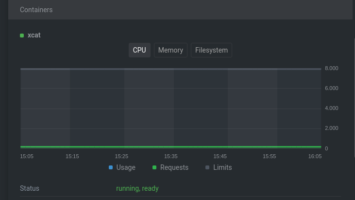

# Develop Applications to integrate into Cluster Factory

This guide covers the general process to develop an application for Cluster
Factory and might help you to integrate your applications.

Let's take the example of xCAT, which is a complex bare-metal provisioning tool.

## 1. Dockerize/Containerize the application

All applications are containerizable. You will need to fetch a lot of
information to see how difficult it is.

You should check for:

- Dependencies:
  - The base image (Ex: Rocky Linux)
  - Build-time setup (enabling the services)
  - Runtime dependencies (Ex: Perl, Apache, xCAT, ...)
  - Runtime setup (the entry-point script)
  - Init system (SystemD)
  - And eventually, host dependencies
- Interfaces:
  - Network:
    - All the TCP and UDP ports (Ex: DHCP, SSH, ...)
    - Host network (Ex: The DHCP server needs the host network to receive broadcast DHCP requests.)
  - Volumes:
    - Persistent Volumes (Ex: The xCAT databases.)
    - Is it possible to set a read-only filesystem?
- Privileges
  - Is it possible to run rootless?
  - Is there any capabilities? (Ex: `NET_BIND_SERVICE`, ...)

Knowing these details will make it easier to write a Dockerfile and test it.

The xCAT Dockerfile:

```dockerfile
FROM quay.io/rockylinux/rockylinux:8.4

LABEL MAINTAINER Square Factory

ENV container docker

ARG xcat_version=latest
ARG xcat_reporoot=https://xcat.org/files/xcat/repos/yum
ARG xcat_baseos=rh8

# Remove useless SystemD services
RUN (cd /lib/systemd/system/sysinit.target.wants/; \
    for i in *; do [ $i == systemd-tmpfiles-setup.service ] || rm -f $i; done); \
    rm -f /lib/systemd/system/multi-user.target.wants/* \
    && rm -f /etc/systemd/system/*.wants/* \
    && rm -f /lib/systemd/system/local-fs.target.wants/* \
    && rm -f /lib/systemd/system/sockets.target.wants/*udev* \
    && rm -f /lib/systemd/system/sockets.target.wants/*initctl* \
    && rm -f /lib/systemd/system/basic.target.wants:/* \
    && rm -f /lib/systemd/system/anaconda.target.wants/*

# Setup symlink
RUN mkdir -p /xcatdata/etc/{dhcp,goconserver,xcat} && ln -sf -t /etc /xcatdata/etc/{dhcp,goconserver,xcat} && \
    mkdir -p /xcatdata/{install,tftpboot} && ln -sf -t / /xcatdata/{install,tftpboot}

# Install dependencies
RUN dnf install -y -q wget which \
    && wget ${xcat_reporoot}/${xcat_version}/$([[ "devel" = "${xcat_version}" ]] && echo 'core-snap' || echo 'xcat-core')/xcat-core.repo -O /etc/yum.repos.d/xcat-core.repo \
    && wget ${xcat_reporoot}/${xcat_version}/xcat-dep/${xcat_baseos}/$(uname -m)/xcat-dep.repo -O /etc/yum.repos.d/xcat-dep.repo \
    && dnf install -y \
    xCAT \
    openssh-server \
    rsyslog \
    createrepo \
    chrony \
    initscripts \
    man \
    nano \
    pigz \
    bash-completion \
    vim \
    epel-release \
    && dnf install -y \
    screen \
    bind-utils \
    && dnf clean all

# Setup SSH
RUN sed -i -e 's|#PermitRootLogin yes|PermitRootLogin yes|g' \
    -e 's|#Port 22|Port 2200|g' \
    -e 's|#UseDNS yes|UseDNS no|g' /etc/ssh/sshd_config \
    && echo "StrictHostKeyChecking no" >> /etc/ssh/ssh_config \
    && echo "root:cluster" | chpasswd \
    && rm -rf /root/.ssh \
    && mv /xcatdata /xcatdata.NEEDINIT

# Enable services
RUN systemctl enable httpd \
    && systemctl enable sshd \
    && systemctl enable dhcpd \
    && systemctl enable rsyslog \
    && systemctl enable xcatd

# Copy our edited genimage
COPY ./opt/xcat/share/xcat/netboot/rh/genimage /opt/xcat/share/xcat/netboot/rh/genimage

COPY entrypoint.sh /entrypoint.sh
RUN chmod +x /entrypoint.sh

COPY startup.sh /startup.sh
RUN chmod +x /startup.sh

ENV XCATROOT /opt/xcat
ENV PATH="$XCATROOT/bin:$XCATROOT/sbin:$XCATROOT/share/xcat/tools:$PATH" MANPATH="$XCATROOT/share/man:$MANPATH"
VOLUME [ "/xcatdata", "/var/log/xcat" ]

EXPOSE 3001/tcp 3001/udp \
  3002/tcp 3002/udp \
  7/udp \
  873/tcp 873/udp \
  53/tcp 53/udp \
  67/tcp 67/udp \
  68/tcp 68/udp \
  69/tcp 69/udp \
  111/udp \
  514/tcp 514/udp \
  4011/tcp \
  623/tcp 623/udp \
  2200/udp

CMD [ "/startup.sh" ]
```

The `EXPOSE` declares which ports must be open for xCAT to be fully functional.

The `VOLUME` declares which volumes need to be persistent.

Other volumes can be mounted as read-only configurations. For example, since
we are running `systemd`, we need to mount the `/sys/fs/cgroup` directory.

The entry point:

```shell title="statup.sh"
#!/bin/bash

setsid ./entrypoint.sh &

exec /sbin/init
```

```shell title="entrypoint.sh"
#!/bin/bash
is_ubuntu=$(test -f /etc/debian_version && echo Y)
[[ -z ${is_ubuntu} ]] && logadm="root:" || logadm="syslog:adm"
chown -R ${logadm} /var/log/xcat/
. /etc/profile.d/xcat.sh
ps -ax
if [[ -d "/xcatdata.NEEDINIT" ]]; then
    echo "initializing xCAT ..."
    if [ ! -f "/xcatdata/.init-finished" ]; then
        echo "first initalization, copying template..."
        rsync -a /xcatdata.NEEDINIT/ /xcatdata

        echo "initalizing database."
        xcatconfig --database

        touch /xcatdata/.init-finished
    fi

    echo "initializing networks table if necessary..."
    xcatconfig --updateinstall
    XCATBYPASS=1 tabdump site | grep domain || XCATBYPASS=1 chtab key=domain site.value=example.com

    if ! [ -L /root/.xcat ]; then
        if ! [ -d /xcatdata/.xcat ]; then
            echo "backup data not found, regenerating certificates and copying..."
            xcatconfig -c
            rsync -a /root/.xcat/* /xcatdata/.xcat
        fi
        echo "create symbol link for /root/.xcat..."
        rm -rf /root/.xcat/
        ln -sf -t /root /xcatdata/.xcat
    fi

    if [ -d /xcatdata/.ssh ]; then
        echo "copy backup keys in /root/.ssh..."
        rsync -a /xcatdata/.ssh/ /root/.ssh/
        chmod 600 /root/.ssh/*
    else
        echo "backup keys not found, copying keys to /xcatdata/.ssh..."
        xcatconfig --sshkeys
        mkdir -p /xcatdata/.ssh
        rsync -a /root/.ssh/ /xcatdata/.ssh/
        chmod 600 /xcatdata/.ssh/*
    fi

    echo "reconfiguring hosts..."
    makehosts
    echo "reconfiguring dns..."
    makedns
    echo "reconfiguring dhcpd config..."
    makedhcp -n
    echo "reconfiguring dhcpd leases..."
    makedhcp -a

    echo "initializing loop devices..."
    # workaround for no loop device could be used by copycds
    for i in {0..7}; do
        test -b /dev/loop$i || mknod /dev/loop$i -m0660 b 7 $i
    done
    # workaround for missing `switch_macmap` (#13)
    ln -sf /opt/xcat/bin/xcatclient /opt/xcat/probe/subcmds/bin/switchprobe
    mv /xcatdata.NEEDINIT /xcatdata.orig
fi

cat /etc/motd
HOSTIPS=$(ip -o -4 addr show up | grep -v "\<lo\>" | xargs -I{} expr {} : ".*inet \([0-9.]*\).*")
echo "@@@@@@@@@@@@@@@@@@@@@@@@@@@@@@@@@@@@@@@@@@@@@@@"
echo "welcome to Dockerized xCAT, please login with"
[[ -n "$HOSTIPS" ]] && for i in $HOSTIPS; do echo "   ssh root@$i -p 2200  "; done && echo "The initial password is \"cluster\""
echo "@@@@@@@@@@@@@@@@@@@@@@@@@@@@@@@@@@@@@@@@@@@@@@@"

systemctl start xcatd
#exec /sbin/init
rm -f /etc/nologin /var/run/nologin
```

## 2. Testing the application with Podman

Podman is an alternative to Docker. The main difference is that Podman is daemon-less.

We will focus on one specific feature which is `podman-play-kube`.

While you might test the container with Docker with `docker-compose` or with `Minikube`, Podman offers the almost same experience as a Kubernetes Cluster without being overkill.

`podman-play-kube` only supports `Pod`, `Deployment`, `PersistentVolumeClaim` and `ConfigMap`, but that's enough since it bridges the gap between `docker-compose` and the Kubernetes syntax.

Let's write a `Pod` for xCAT:

```yaml title="pod.yaml"
apiVersion: v1
kind: Pod
metadata:
  name: 'xcat'
  namespace: default
  labels:
    app: 'xcat'
spec:
  hostNetwork: true
  containers:
    - name: xcat
      image: 'xcat:latest'
      imagePullPolicy: Never
      securityContext:
        capabilities:
          add:
            - CAP_SYS_ADMIN
            - NET_ADMIN
        readOnlyRootFilesystem: false
        runAsNonRoot: false
        runAsUser: 0
      resources:
        limits:
          cpu: 200m
          memory: 500Mi
        requests:
          cpu: 100m
          memory: 200Mi
      ports:
        - name: xcatdport-tcp
          containerPort: 3001
          protocol: TCP
        - name: xcatdport-udp
          containerPort: 3001
          protocol: UDP
        - name: xcatiport-tcp
          containerPort: 3002
          protocol: TCP
        - name: xcatiport-udp
          containerPort: 3002
          protocol: UDP
        - name: echo-udp
          containerPort: 7
          protocol: UDP
        - name: rsync-tcp
          containerPort: 873
          protocol: TCP
        - name: rsync-udp
          containerPort: 873
          protocol: UDP
        - name: domain-tcp
          containerPort: 53
          protocol: TCP
        - name: domain-udp
          containerPort: 53
          protocol: UDP
        - name: bootps
          containerPort: 67
          protocol: UDP
        - name: dhcp
          containerPort: 67
          protocol: TCP
        - name: dhcpc
          containerPort: 68
          protocol: TCP
        - name: bootpc
          containerPort: 68
          protocol: UDP
        - name: tftp-tcp
          containerPort: 69
          protocol: TCP
        - name: tftp-udp
          containerPort: 69
          protocol: UDP
        - name: www-tcp
          containerPort: 80
          protocol: TCP
        - name: www-udp
          containerPort: 80
          protocol: UDP
        - name: sunrpc-udp
          containerPort: 111
          protocol: UDP
        - name: rsyslogd-tcp
          containerPort: 514
          protocol: TCP
        - name: rsyslogd-udp
          containerPort: 514
          protocol: UDP
        - name: pxe
          containerPort: 4011
          protocol: TCP
        - name: ipmi-tcp
          containerPort: 623
          protocol: TCP
        - name: ipmi-udp
          containerPort: 623
          protocol: UDP
        - name: ssh-tcp
          containerPort: 2200
          protocol: TCP
        - name: ssh-udp
          containerPort: 2200
          protocol: UDP
      volumeMounts:
        - name: xcatdata
          mountPath: /xcatdata
        - name: cgroup
          mountPath: /sys/fs/cgroup
          readOnly: true
        - name: varlogxcat
          mountPath: /var/log/xcat
        - mountPath: /tmp
          name: tmp
          subPath: tmp
        - mountPath: /run
          name: tmp
          subPath: run
        - mountPath: /run/lock
          name: tmp
          subPath: run-lock
  volumes:
    - name: tmp
      hostPath:
        path: ./tmp
    - name: varlogxcat
      hostPath:
        path: ./logs
    - name: xcatdata
      hostPath:
        path: ./xcat
    - name: cgroup
      hostPath:
        path: /sys/fs/cgroup
        type: Directory
  restartPolicy: Always
```

If we were to write a `docker-compose.yml`, we would open the same port, mount the same volumes and add the same capabilities.

The main advantage is that if it works with podman, it will certainly work with Kubernetes.

One main disadvantage is that `podman-play-kube` doesn't support the use of `networks` (which means no support for macvlan and ipvlan). The issue is tracked [here](https://github.com/containers/podman/issues/12965).

## 3. Writing a Helm application

Although it is not necessary to write a Helm application, some values may be redundant or must be abstracted.

That's why we prefer to write Helm Charts instead of Kustomize. If the application is light enough, we can use Kustomize instead.

To write a Helm application, we need to generalize the values (by using
`example.com` as domain for example). The "overlay" values will be stored
either inside the Helm application or inside a Git repository.

At SquareFactory, we've been storing the values inside the Argo CD `Application` files. If we need to track these values inside Git, we can use the `App of Apps` pattern.

The Helm application must be available on a publicly accessible Git or Helm repository.

The example for xCAT is stored inside [`helm/xcat`](https://github.com/SquareFactory/cluster-factory-ce/tree/main/helm/xcat).

## 4. Writing the Argo CD Application

After writing the Helm Chart, you can write the Argo CD `Application`.

The example for xCAT is stored inside [`argo/provisioning/apps`](https://github.com/SquareFactory/cluster-factory-ce/blob/main/argo/provisioning/apps/xcat-app.yml).

## 5. Testing on the Kubernetes cluster

Our favorite tool for debugging is [Lens](https://k8slens.dev).

If you have deployed Prometheus, we can see the CPU and Memory usage of the container.


