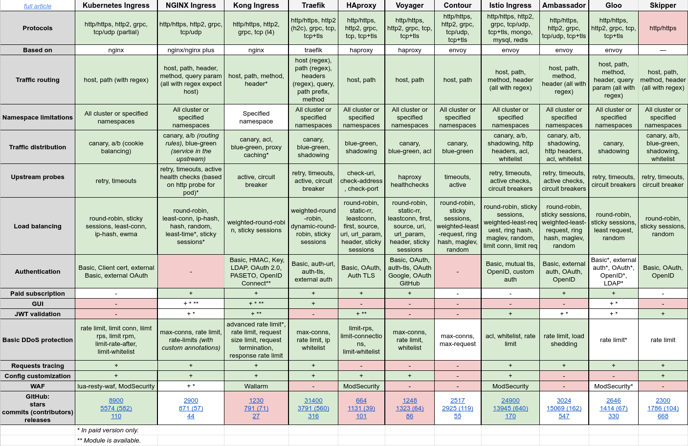

# Traefik, the All-in-One L7 Load Balancer and Ingress

The reason we are not using NGINX Ingress Controller is quite simple. Thanks to the `IngressRoute` custom resource definition, we can practically do everything, including TCP and UDP routing.

Traefik has also a Dashboard which simply makes an experience more friendly.

Traefik is not the standard solution, so feel free to change the main Ingress!

A comparison made by Flant Staff can help you decide:

Their article is [on Medium](https://medium.com/flant-com/comparing-ingress-controllers-for-kubernetes-9b397483b46b).

You can also combine Ingresses since they mainly do routing. A combo Traefik as external Ingress and Istio as Service Mesh can be quite interesting.
