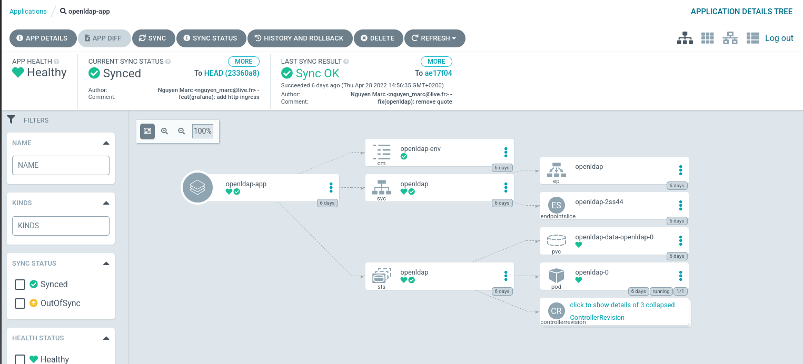

# Argo CD

Argo CD is a GitOps continuous delivery tool for Kubernetes. It clones, retrieves all changes from a Git repository and deploys the application based on the declarative definition files.

In this way, we are able to set up a zero-trust infrastructure where all we need to do is modify the YAML files in the Git repository, and Argo CD will deploy automatically.

Everything is stored in the Git repository like volumes, Argo CD applications, ... The Git repository becomes the source of truth and everyone can access it safely.

Argo CD has also a dashboard, which permits a great visualization of the cluster, for administrators and operators.

Argo CD can be replaced with [Flux CD](https://fluxcd.io).
