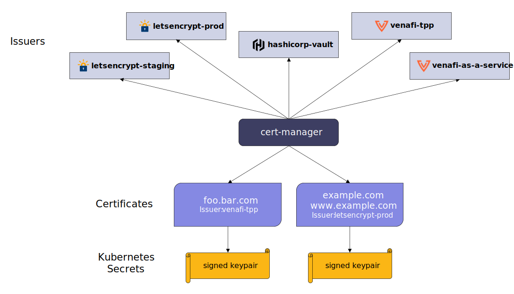

# cert-manager, the Certificate Manager

Like the name indicates, cert-manager adds certificates and certificate issuers as custom resources for Kubernetes.

It's possible to manage self-signed certificates, a private CA, ACME issuers, ...

cert-manager also automatically generates and renews certificates using the Kubernetes annotation field in the Ingress resource.

Although cert-manager [is not compatible with the Traefik IngressRoute resource](https://doc.traefik.io/traefik/master/providers/kubernetes-crd/#letsencrypt-support-with-the-custom-resource-definition-provider), the certificate can be managed using a [Certificate resource](https://cert-manager.io/docs/usage/certificate/).
