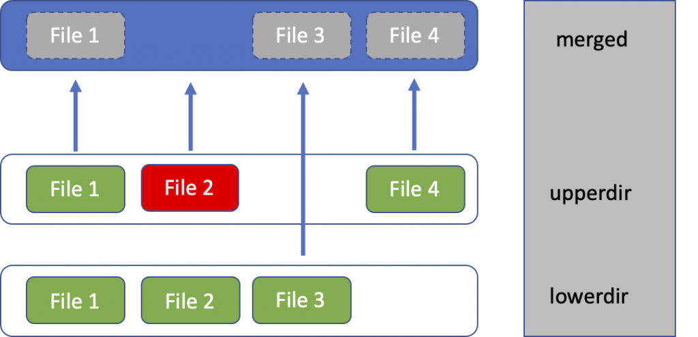

# xCAT, the Bare-Metal Provisioner

[xCAT](https://xcat.org) is complete solution for bare metal provisioning for
High-Performance Computing clusters.

## Architecture

The architecture is the following:

**xCAT Management Node** is deployed as a container and runs multiple network services responsible for the provisioning of bare-metal systems.

xCAT is also able to have "slaves" named **Service Node.**

**The Service Processor (SP)** controls the hardware and is used to perform out-of-band hardware control (e.g. Integrated Management Module (IMM), Flexible Service Processor (FSP), Baseboard Management Controller (BMC), etc).

The Service Processor is connected to xCAT via **the Service Network.**

**The Management Network** is used for OS provisioning (via xNBA or PXE).

## Why xCAT ?

Our main criteria for choosing a bare metal provisioning solution is:

- Operating system image management: provisioning methods, supported operating systems, ease of use.
- BMC configuration (IPMI, HMC, FSP, OpenBMC)
- Configuration management (Declarative, post-boot scripts, backups, ...)

While a lot of solutions exist for bare-metal provisioning like [OpenStack Ironic](https://wiki.openstack.org/wiki/Ironic) or [MAAS](https://maas.io/), only a few are able to do **disk-less provisioning**.

Disk-less (or Stateless) provisioning is based on an OverlayFS root, with the OS being loaded from a SquashFS image. The OverlayFS is mounted as a `tmpfs`, that is, in the RAM.

Since the root is mounted in RAM, restarting a node will "clean it up", similar to a Docker container.

With OverlayFS, we follow a proper DevOps practice where the architecture is immutable and mutable data is stored on disks.

Moreover, we are not only looking for a well-maintained open-source project, but also an easy-to-use solution.

export const xCatAge = new Date(1999, 10, 31).getTime();

  We were interested in <a href="https://github.com/ubccr/grendel">Grendel</a> because it promises
  to be better than xCAT, but it is still too young and its documentation is not yet perfect. xCAT
  is {Math.abs(new Date(Date.now() - xCatAge).getUTCFullYear() - 1970)} years old, is still
  maintained by iBM and has every functionality for bare metal provisioning.

While xCAT is not friendly to GitOps or Kubernetes, we plan to develop a way to configure xCAT declaratively from Kubernetes (probably by developing a [Kubernetes Operator](https://kubernetes.io/docs/concepts/extend-kubernetes/operator/), or by applying the [stanza file](https://xcat-docs.readthedocs.io/en/stable/guides/admin-guides/references/man5/xcatstanzafile.5.html) at the boot of container).

For now, the only way to use xCAT is to connect via SSH to your server.
